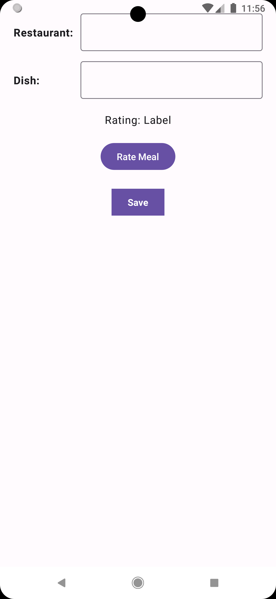
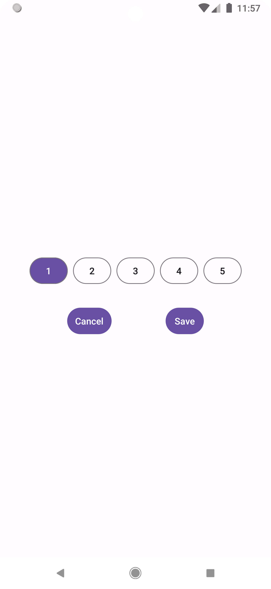

# MealRater

**MealRater** is an Android application built with **Jetpack Compose** that allows users to rate meals at different restaurants and store them locally using **Room Database**. The app demonstrates modern Android development patterns such as Compose UI, Navigation, and asynchronous data handling with Kotlin Coroutines.

---

## Table of Contents

- [Features](#features)
- [Screenshots](#screenshots)
- [Installation](#installation)
- [Usage](#usage)
- [Dependencies](#dependencies)
- [Database](#database)

---

## Features

- Add restaurant and dish names.  
- Select a meal rating on a separate screen.  
- Save meals locally with **Room Database**.  
- Display status messages for feedback.  
- Jetpack Compose UI using **Material 3**.  
- Handles back stack state for rating selection.

---

## Screenshots

<!-- Replace the image paths with actual screenshots from your project -->

  
*Main screen for entering meal and restaurant details.*

  
*Screen for selecting a meal rating.*

---

## Installation

1. Clone the repository:

```bash
git clone https://github.com/yourusername/MealRater.git
```


2. Open the project in **Android Studio**.  
3. Make sure your Android SDK is set to **API 34** or higher.  
4. Build and run the app on an emulator or device running **Android 7.0 (API 24)** or higher.

---

## Usage

1. Launch the app.  
2. Enter **Restaurant** and **Dish** names.  
3. Tap **Rate Meal** to navigate to the rating screen and select a rating.  
4. Return to the main screen; the selected rating will appear under "Rating".  
5. Press **Save** to store the meal in the local database.  
6. A status message will confirm if the save was successful.

---

## Dependencies

Key dependencies:

- **Jetpack Compose** (Material 3, UI, UI Tooling)  
- **Compose Navigation**  
- **Room Database** (Room Runtime, Room KTX, Room Compiler)  
- **Kotlin Coroutines** for asynchronous operations  
- **AndroidX Core KTX, AppCompat, ConstraintLayout**  
- **Testing:** JUnit, Espresso, Compose UI Testing  

Full versions are defined in `build.gradle`.

---

## Database

The app uses **Room** for local storage:

- **Entity:** `Meal`  
  - Fields: `id`, `restaurant`, `dish`, `rating`  
- **DAO:** `MealDao`  
  - Methods to insert and fetch all meals  
- **Database class:** `AppDatabase`  

Example function to save a meal:

```kotlin
fun saveMealData(
    db: AppDatabase?,
    restaurant: String,
    dish: String,
    rating: String,
    onResult: (String) -> Unit
)
```
